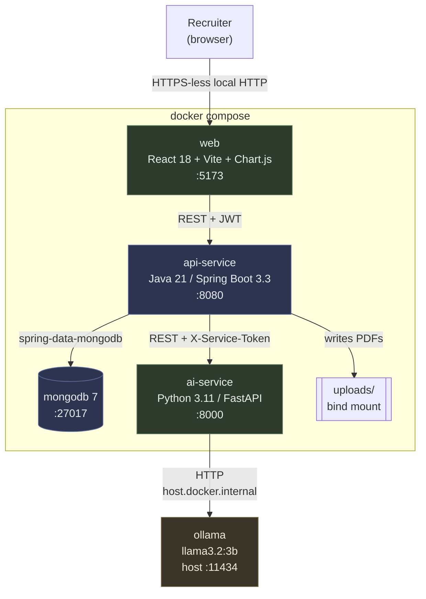
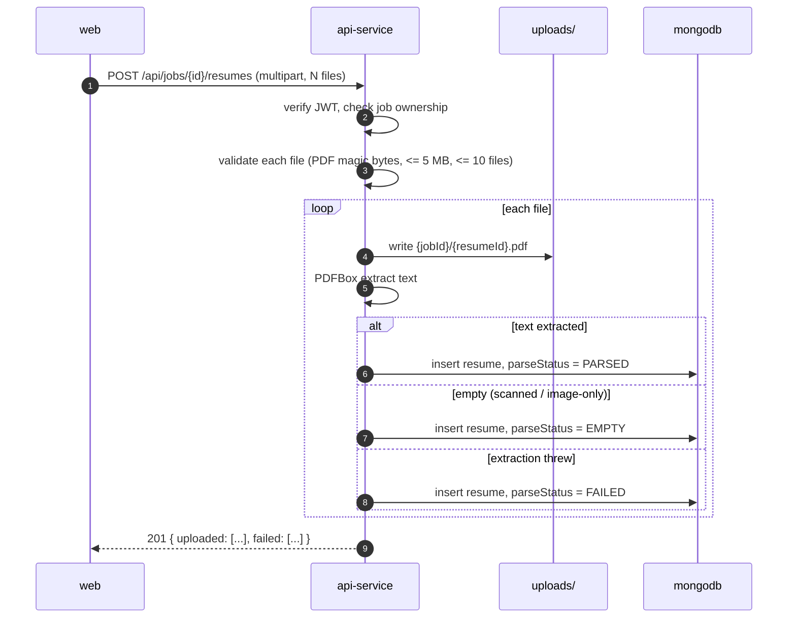
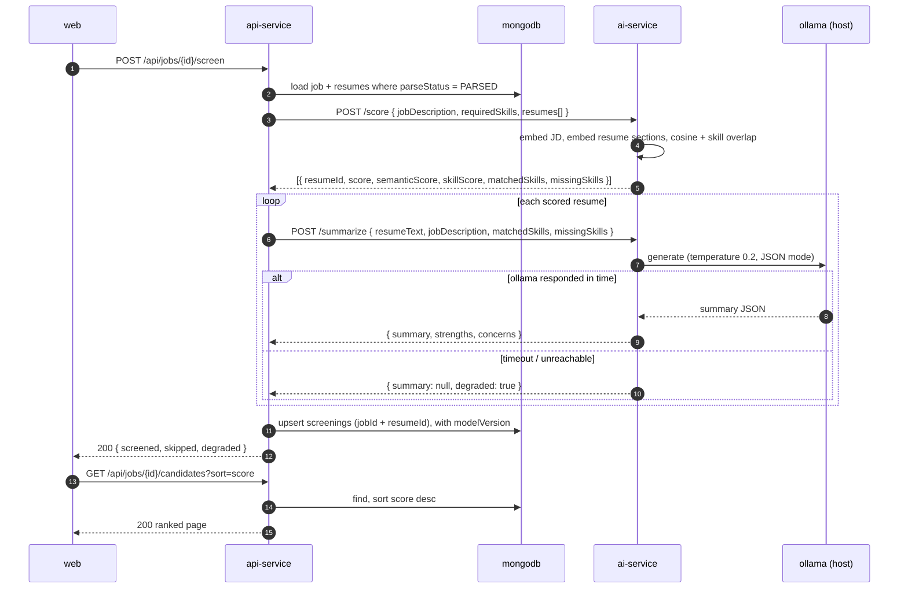

# Architecture

## Containers

Green = Moayad. Blue = Marwan. Amber = runs on the host, not in Compose.

## Boundary rules

These are the rules that keep the two halves from growing into each other.
Breaking one of them is a design change, not a shortcut.

1. **The browser never talks to `ai-service`.** Every request from `web` goes to
   `api-service`. `ai-service` has no user auth, no CORS config, and no route
   published outside the Compose network. If the dashboard needs something the AI
   produces, `api-service` exposes it.

2. **`api-service` is the only writer to MongoDB.** `ai-service` is stateless —
   it takes text in and returns numbers and strings. It holds no database
   connection and doesn't know what a `jobId` means beyond an opaque string it
   echoes back.

3. **`api-service` owns all persistence and identity.** JWT issuing and
   verification, password hashing, file storage, ownership checks.

4. **`ai-service` owns all model behaviour.** Which embedding model, how text is
   chunked, how the score is composed, what the summarization prompt says. If the
   score formula changes, only `ai-service` changes.

5. **Ollama runs on the host.** Docker Desktop on macOS can't pass the GPU
   through to a container, so a containerized Ollama would run on CPU and be
   painfully slow. Containers reach the host daemon at
   `host.docker.internal:11434`.

## Why scoring is deterministic

**The language model is not in the scoring path.** The score comes from
embeddings and cosine similarity — same input, same output, every time. Ollama is
only used afterwards to write the human-readable summary.

We considered asking the model to score directly ("rate this resume 0–100 for
this role"). We rejected it:

- The number wouldn't be reproducible across runs, which makes the ranking
  unstable and the tests impossible to write meaningfully.
- We couldn't explain a score, only ask for a rationalization after the fact.
- Rankings would drift whenever the model was updated, with no version to point at.

So: **embeddings decide the order, the model only narrates it.** If the summary
generation fails or Ollama is down, the score is still returned and the summary
comes back `null` — a degraded but functional result. The reverse is not true;
if scoring fails the whole screening fails.

## Flow 1 — upload and parse

A file that fails to parse still produces a `resumes` document. The recruiter
needs to see "we couldn't read this one", not have it vanish.

## Flow 2 — screening

Screening is synchronous and capped by `MAX_RESUMES_PER_SCREEN` (default 50).
Above that, `api-service` returns `422 BATCH_TOO_LARGE` rather than hanging the
request. That cap is the thing an async queue removes later.

Re-screening the same job **upserts** on `(jobId, resumeId)` — one screening row
per pair, always the latest. `modelVersion` and `scoredAt` record what produced it.

## Technology choices and why

| Choice | Reason | What we gave up |
|---|---|---|
| Two services, not one | The AI half needs the Python ecosystem; the API half is a better fit for Spring. Splitting them also splits the work cleanly between us. | Network hop, a contract to maintain, more moving parts locally. |
| MongoDB | Resume documents are irregular — variable sections, optional fields, a skills array. Fits a document store without migrations while the shape is still moving. | No joins; `screenings` denormalizes a bit of resume data for the list view. |
| `all-MiniLM-L6-v2` | 384-dim, ~90 MB, runs fine on CPU, good enough for short-text similarity. Fast enough that a 50-resume batch stays inside one request. | Weaker than a larger model on long documents. Section-chunking is partly a workaround for its 256-token window. |
| Local Ollama over a hosted API | No key, no per-call cost, resume text never leaves the machine — which matters given the content. | Setup burden on each laptop, slower, weaker model. |
| Synchronous screening | Far simpler; no queue, no worker, no polling UI. | Hard batch cap and a long-running HTTP request. |

## Ports

| Service | Port | Reachable from browser |
|---|---|---|
| web (Vite dev) | 5173 | yes |
| api-service | 8080 | yes |
| ai-service | 8000 | **no** — Compose network only |
| mongodb | 27017 | no |
| ollama | 11434 (host) | no |

`ai-service` and `mongodb` publish no host ports in the production Compose
profile. They're published in the dev profile so we can curl them directly while
building; see [07-LOCAL-DEV.md](07-LOCAL-DEV.md).
