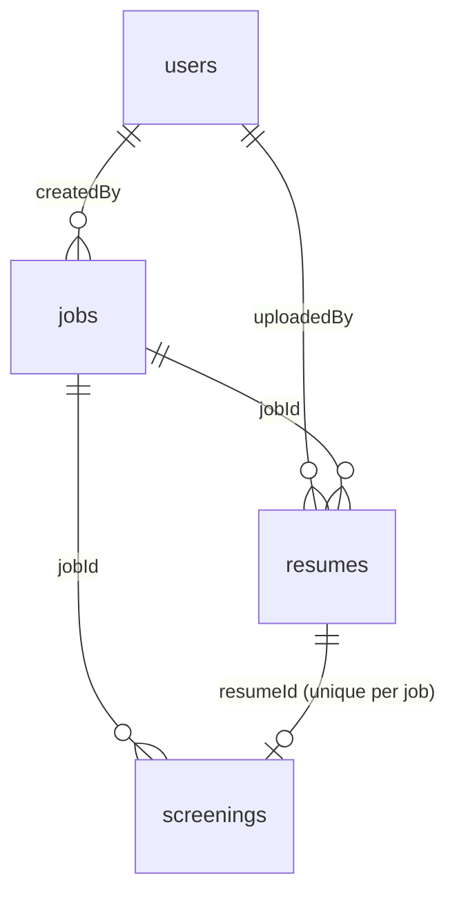

# Data model

MongoDB 7, database `screener`. Four collections. `api-service` is the only
writer — see [01-ARCHITECTURE.md](01-ARCHITECTURE.md).

## Conventions

- `_id` is a MongoDB `ObjectId`. It is serialized to JSON as a 24-char hex
  **string** named `id`. `_id` never appears in an API response.
- Timestamps are stored as BSON dates, serialized as ISO-8601 UTC with `Z`.
- Field names are `camelCase` in both the database and the API, so there's no
  mapping layer to get wrong.
- No embedded documents deeper than one level. Keeps queries and DTOs boring.

## `users`

A recruiter account.

| Field | Type | Required | Notes |
|---|---|---|---|
| `_id` | ObjectId | yes | |
| `email` | string | yes | Lowercased on write. Unique. |
| `passwordHash` | string | yes | BCrypt, strength 10. **Never leaves the service** — no DTO exposes it. |
| `fullName` | string | yes | |
| `role` | string | yes | `RECRUITER`. Only value in v1; present so adding `ADMIN` later isn't a migration. |
| `createdAt` | date | yes | |

```json
{
  "_id": "665f1a2b3c4d5e6f70819200",
  "email": "recruiter@example.com",
  "passwordHash": "$2a$10$...",
  "fullName": "Sara Haddad",
  "role": "RECRUITER",
  "createdAt": "2026-08-12T09:14:03.221Z"
}
```

## `jobs`

A posting to screen against.

| Field | Type | Required | Notes |
|---|---|---|---|
| `_id` | ObjectId | yes | |
| `title` | string | yes | 3–120 chars. |
| `description` | string | yes | 50–20000 chars. Free text — this is what gets embedded. |
| `requiredSkills` | string[] | yes | Lowercased, trimmed, de-duplicated on write. May be empty, but then `skillScore` is 0 for everyone and the score is purely semantic. |
| `location` | string | no | Display only, not scored. |
| `createdBy` | ObjectId | yes | → `users._id`. Ownership check on every job route. |
| `createdAt` | date | yes | |
| `updatedAt` | date | yes | |

```json
{
  "_id": "665f1a2b3c4d5e6f70819201",
  "title": "Backend Engineer (Java)",
  "description": "We're looking for a backend engineer to build and maintain our REST APIs...",
  "requiredSkills": ["java", "spring boot", "mongodb", "docker", "rest api"],
  "location": "Amman, Jordan",
  "createdBy": "665f1a2b3c4d5e6f70819200",
  "createdAt": "2026-08-12T09:20:11.004Z",
  "updatedAt": "2026-08-12T09:20:11.004Z"
}
```

## `resumes`

One uploaded PDF. Belongs to exactly one job — the same person applying to two
jobs produces two documents. Deduplication is a v2 problem.

| Field | Type | Required | Notes |
|---|---|---|---|
| `_id` | ObjectId | yes | |
| `jobId` | ObjectId | yes | → `jobs._id` |
| `candidateName` | string | yes | Best-effort: first non-empty line of extracted text, else the filename without extension. Recruiter can correct it later. |
| `candidateEmail` | string | no | First regex email match in the text, else null. |
| `originalFilename` | string | yes | As uploaded. Shown in the UI. |
| `storagePath` | string | yes | Relative: `{jobId}/{resumeId}.pdf`. Never absolute — the container path is config. |
| `contentHash` | string | yes | SHA-256 of the file bytes. Lets us spot a re-upload of the same file. |
| `parsedText` | string | yes | Extracted text. Empty string when `parseStatus != PARSED`. |
| `pageCount` | int | yes | 0 when parsing failed. |
| `parseStatus` | string | yes | `PARSED` \| `EMPTY` \| `FAILED` — see below. |
| `parseError` | string | no | Exception message when `FAILED`. For our debugging, not shown to recruiters. |
| `sizeBytes` | long | yes | |
| `uploadedBy` | ObjectId | yes | → `users._id` |
| `uploadedAt` | date | yes | |

### `parseStatus`

| Value | Means | Screened? |
|---|---|---|
| `PARSED` | Text extracted, non-empty after trimming. | Yes |
| `EMPTY` | PDF opened fine but yielded no text — almost always a scan or an image-only export. | No. Counted in `skipped`. |
| `FAILED` | PDFBox threw: encrypted, corrupt, or not really a PDF. | No. Counted in `skipped`. |

We keep the document in all three cases. The recruiter needs to see that a file
was unreadable — silently dropping it is how someone gets missed.

```json
{
  "_id": "665f1a2b3c4d5e6f70819210",
  "jobId": "665f1a2b3c4d5e6f70819201",
  "candidateName": "Omar Khalil",
  "candidateEmail": "omar.khalil@example.com",
  "originalFilename": "Omar_Khalil_CV.pdf",
  "storagePath": "665f1a2b3c4d5e6f70819201/665f1a2b3c4d5e6f70819210.pdf",
  "contentHash": "9f2c1e...",
  "parsedText": "Omar Khalil\nBackend Engineer\n\nEXPERIENCE\n...",
  "pageCount": 2,
  "parseStatus": "PARSED",
  "parseError": null,
  "sizeBytes": 184320,
  "uploadedBy": "665f1a2b3c4d5e6f70819200",
  "uploadedAt": "2026-08-12T09:31:47.882Z"
}
```

## `screenings`

The scoring result for one (job, resume) pair. **Upserted** on that pair — a
re-screen overwrites rather than appends, so there is exactly one current result
per candidate.

| Field | Type | Required | Notes |
|---|---|---|---|
| `_id` | ObjectId | yes | |
| `jobId` | ObjectId | yes | → `jobs._id` |
| `resumeId` | ObjectId | yes | → `resumes._id`. Unique together with `jobId`. |
| `candidateName` | string | yes | **Denormalized** from `resumes` so the ranked list is one query. Re-copied on every screening. |
| `score` | int | yes | 0–100. The ranking key. |
| `semanticScore` | double | yes | 0.0–1.0, 4 decimals. Pre-weighting. |
| `skillScore` | double | yes | 0.0–1.0, 4 decimals. Pre-weighting. |
| `matchedSkills` | string[] | yes | Subset of the job's `requiredSkills` found in the resume. |
| `missingSkills` | string[] | yes | The rest. `matched ∪ missing == requiredSkills`. |
| `summary` | string | no | 2–3 sentences. **`null` when Ollama was unavailable** — not an error state. |
| `strengths` | string[] | no | Up to 3 bullets. Null alongside `summary`. |
| `concerns` | string[] | no | Up to 3 bullets. Null alongside `summary`. |
| `summaryDegraded` | bool | yes | `true` when scoring succeeded but summarization didn't. Drives the "summary unavailable" chip in the UI. |
| `modelVersion` | string | yes | e.g. `all-MiniLM-L6-v2@c9745ed`. |
| `promptVersion` | string | no | e.g. `v1`. Null when there's no summary. |
| `weights` | object | yes | `{ "semantic": 0.7, "skill": 0.3 }` as used for this run. |
| `scoredAt` | date | yes | |

`modelVersion`, `promptVersion`, and `weights` are stored per screening on
purpose: when a score changes between two runs we need to know whether the
resume changed or we did.

```json
{
  "_id": "665f1a2b3c4d5e6f70819220",
  "jobId": "665f1a2b3c4d5e6f70819201",
  "resumeId": "665f1a2b3c4d5e6f70819210",
  "candidateName": "Omar Khalil",
  "score": 82,
  "semanticScore": 0.7913,
  "skillScore": 0.8,
  "matchedSkills": ["java", "spring boot", "mongodb", "docker"],
  "missingSkills": ["rest api"],
  "summary": "Strong Java backend background with four years on Spring Boot services and hands-on MongoDB work. Docker experience is production-level rather than incidental. No explicit REST API design ownership called out, though it is implied by the service work.",
  "strengths": ["4 years Spring Boot in production", "Owns containerized deploys", "Direct MongoDB schema experience"],
  "concerns": ["No explicit API design ownership", "No testing frameworks named"],
  "summaryDegraded": false,
  "modelVersion": "all-MiniLM-L6-v2@c9745ed",
  "promptVersion": "v1",
  "weights": { "semantic": 0.7, "skill": 0.3 },
  "scoredAt": "2026-08-12T09:35:02.417Z"
}
```

## Indexes

Created at startup by `api-service` (`MongoIndexConfig`), not by hand, so a fresh
volume is always correct.

| Collection | Index | Type | Why |
|---|---|---|---|
| `users` | `{ email: 1 }` | unique | Login lookup; enforces one account per address. |
| `jobs` | `{ createdBy: 1, createdAt: -1 }` | | "My jobs, newest first" — the jobs list. |
| `resumes` | `{ jobId: 1 }` | | All resumes for a job. |
| `resumes` | `{ jobId: 1, contentHash: 1 }` | | Detect a duplicate upload within one job. |
| `screenings` | `{ jobId: 1, resumeId: 1 }` | **unique** | Enforces one result per pair; the upsert key. |
| `screenings` | `{ jobId: 1, score: -1 }` | | The ranked list. This is the hot query. |

## Relationships



There are no database-level foreign keys — Mongo doesn't have them. Referential
integrity is the service's job:

- Deleting a job cascades to its `resumes`, its `screenings`, and its upload
  directory, in that order. (Job deletion is v1.1; the cascade is written down
  now so it isn't forgotten.)
- Every job-scoped route checks `job.createdBy == currentUser.id` before doing
  anything. A recruiter must not be able to read another recruiter's candidates
  by guessing an ObjectId.

## What we don't store

- **Embedding vectors.** Recomputing 50 × 384 floats is fast; caching them means
  a cache to invalidate on every model change. If screening ever gets slow enough
  to care, a `vectors` collection keyed by `contentHash` + `modelVersion` is the
  shape to add.
- **Raw PDF bytes in Mongo.** Files go to the `uploads/` bind mount. GridFS is
  the upgrade path once one machine's disk stops being the whole story.
- **Anything from Ollama beyond the finished summary.** No token counts, no raw
  responses.
